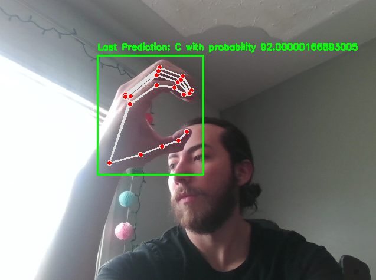

# ENEL645 Final Project - live American Sign Language detection system

1. The main notebook is `asl-model.ipynb`.
1. The fully trained model is `asl-model.h5`.
1. The instructions to run it on TALC is `asl-model.slurm`.

This is how our detection system looks like:

